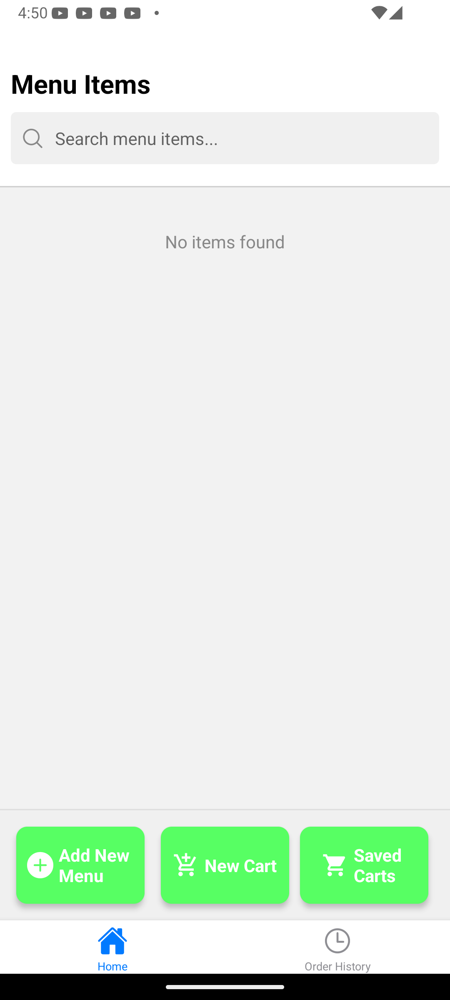
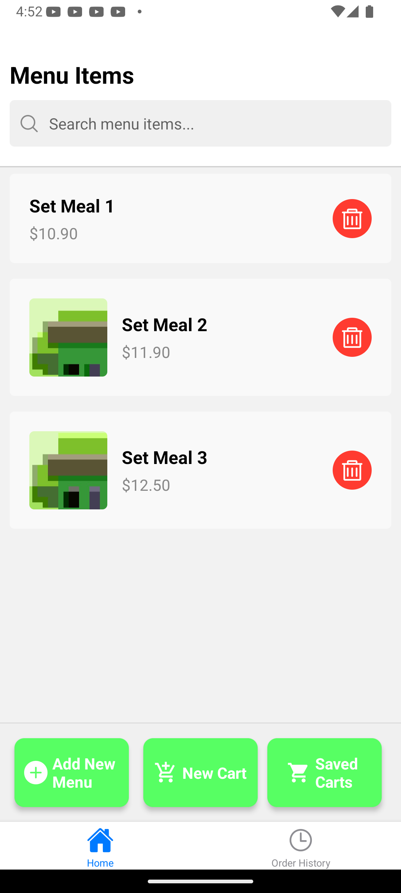
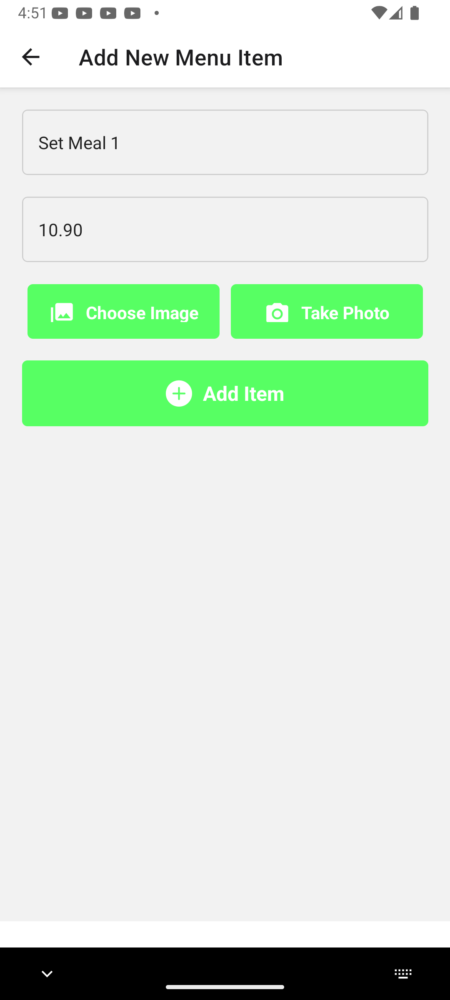
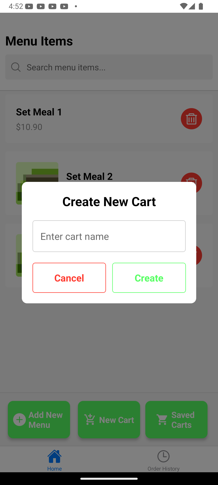
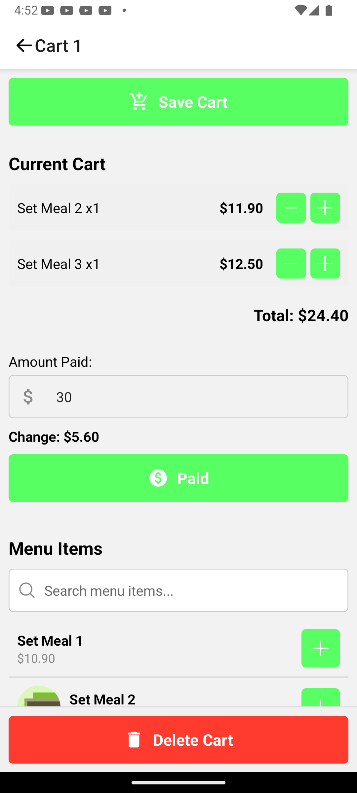
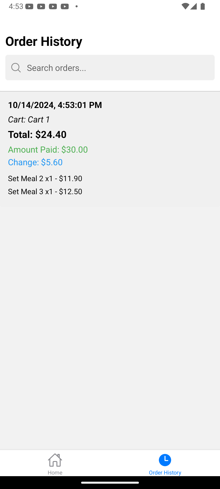

# Welcome to POSGo, the point of sale app on-the-go! 👋

This is a point of sale app on-the-go for small businesses, it is free and open source, built with React Native and Expo.

## Navigating the app
There are 3 buttons and 2 tabs when you open the app:
Buttons:
   - The "Add New Menu" button takes you to the add new menu item screen.
   - The "New Cart" button takes you to the new cart screen.
   - The "Saved Carts" button takes you to the saved carts screen, which is basically just new carts that you saved.

Tabs:
   - The home tab takes you to the home screen.
   - The orders history tab takes you to the orders history screen.

1. The home screen is the main screen you'll see when you open the app. It shows a list of all the products in the menu.

2. The add new menu item screen is where you can add a new menu item to the menu.

3. The new cart screen is where you can create a new cart.

4. In either new cart or saved cart, you can edit the cart by adding the menu items.

5. The orders history screen is where you can view all the orders that you have made.

## How to install
1. Clone the repo
2. Run `npm install`
3. Run `npx expo start`

## I look forward to your contributions!
PLEASE IF YOU HAPPEN TO COME ACROSS THIS PROJECT AND FIND IT USEFUL AND INTERESTING, I'D LOVE TO HAVE YOU CONTRIBUTE TO THIS PROJECT AND PLEASE HELP ME MAKE MY BABY BETTER, THANK YOU BELY MUCHIE ARIGATOU GOZAIMASU🙏🙇‍♂️🙇‍♀️.

